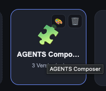

 What is this? A pallete? make it a cogwheel.

## Acceptance criteria

- [x] Der Knopf auf der App-Kachel, der die App-Einstellungen (Icon-Dialog)
      öffnet, zeigt ein **Zahnrad** statt der Palette.
- [x] Durch einen Test abgesichert.

## Notes (implementation)

- Einzige Fundstelle: `src/views/DesktopView.vue` — die Kachel-Aktion
  `title="Icon ändern"` trug `🎨`, jetzt `⚙` (U+2699, Textdarstellung). Damit
  passt sie zum monochromen `🗑` daneben und nimmt die `.act`-Farbe
  (`--muted`, beim Überfahren `--text`) an, was ein farbiges Emoji nicht täte.
- Der Icon-Knopf in der Fensterkopfzeile (`WindowFrame.vue`) zeigt weiterhin
  das App-Icon selbst — dort gab es nie eine Palette.

## Log

- 2026-08-08 status → in-progress (agent)
- 2026-08-08 status → review (agent)
- 2026-08-08 status → done (app)
