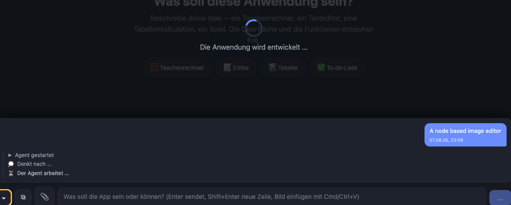

When the chat is collapsed show the „agent thinks“, „agent works“, etc. in the busy indicators text.

Also right now I see „agents works“ for a loooong time. Any more details we can display here?

Also show elapsed time

Make the chat not auto open after submit

## Notes

Die Warteanzeige über der App (`WindowFrame`, `.w-loading`) ist jetzt die
Hauptbühne des Laufs — der Chat muss dafür nicht mehr aufklappen:

- **Laufender Schritt in der Warteanzeige.** `agentBusyLabel`/`agentBusyIcon`
  (core/agent) machen aus dem Fortschrittsstrom die eine Zeile, die gerade
  gilt: „Denkt nach …“, „Read: src/index.html“, „Schreibt src/app.js“. Ohne
  Meldung bleibt es beim allgemeinen „Der Agent arbeitet …“.
- **Mehr Detail statt „arbeitet“.** Die Zeile trägt den Werkzeugnamen samt Ziel
  (der Strom liefert das bereits) — der lange Leerlauf war nur der feste Text.
- **Laufzeit.** `store.runStartedAt` hält den Beginn des Laufs fest, die
  Zusammensetzung `useElapsed` tickt daraus m:ss (ab einer Stunde h:mm:ss).
  Sie steht in der Warteanzeige und in der laufenden Chat-Zeile („Der Agent
  arbeitet … (1:05)“) — so ist auch ein langer Schritt sichtbar am Leben.
- **Kein Aufklappen mehr beim Absenden.** Der `busy`-Watcher im ChatDock klappt
  nicht mehr auf; ein vom Anwender aufgeklappter Verlauf bleibt offen, und eine
  Rückfrage des LLM klappt weiterhin auf (dort wird ja eine Antwort gebraucht).

`stepIcon` ist aus dem ChatDock nach `core/agent` gewandert (`agentEventIcon`),
damit Chat und Warteanzeige dieselben Zeichen benutzen.

## Log

- 2026-08-08 status → ready (app)
- 2026-08-08 status → in-progress (agent)
- 2026-08-08 status → review (agent)
