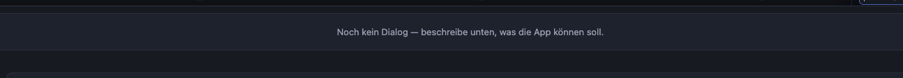

In that scenario I want to be able to start the design mode from the „noch kein dialog“ space. Add the option to open mode there

## What

Seit c0112 darf auch eine App, die es noch nicht gibt, einen Entwurf haben — zu
finden ist er aber nur über das 📐 in der Titelleiste. Wer eine neue App
beschreibt, schaut nicht dorthin, sondern auf den leeren Verlauf („Noch kein
Dialog — beschreibe unten …“): Genau da steht man, solange man nichts gesagt
hat, und genau da gehört der Hinweis hin, dass sich die Gliederung auch zeichnen
lässt. Also bietet der leere Verlauf eines Entwurfs den Entwurfs-Modus mit an.

## Acceptance criteria

- [x] Im leeren Verlauf eines Entwurfs (neue App) steht neben „Noch kein Dialog“
      der Weg zum Entwurfs-Modus; ein Klick öffnet ihn.
- [x] Steht der Entwurf schon offen, ist im Verlauf nichts mehr anzubieten.
- [x] Eine bestehende App bekommt das Angebot nicht — dort steht 📐 in der
      Titelleiste.
- [x] Mit der ersten Nachricht ist der leere Verlauf (und mit ihm das Angebot)
      vorbei.
- [x] `.spec.ts` decken beides ab: `ChatDock` (das Angebot und seine Grenzen) und
      `AppWindow` (der Klick öffnet wirklich die Schicht).

## Notes

**Angeboten wird, wo man steht.** Der `ChatDock` weiß seit c0112 mit `newApp`
schon, dass eine neue App entsteht — dieselbe Fahne trägt jetzt auch das Angebot
im leeren Verlauf. Der Chat öffnet den Entwurf aber nicht selbst: Er meldet
`open-design` nach oben, und das Fenster ruft `store.openDesign()`. Damit bleibt
der Entwurfs-Modus dort, wo er hingehört (`stores/app`), und der Chat kennt
weiterhin nur seinen eigenen Kram.

**Offen ist offen.** `designOpen` reist als Prop mit, damit das Angebot
verschwindet, sobald die Schicht liegt — sonst stünde im Verlauf ein Knopf, der
etwas verspricht, was schon da ist. Geöffnet wird darum mit `openDesign` und
nicht mit `toggleDesign`: Der Knopf ist ein Angebot und kein Umschalter, und ein
Umschalter, der nur im ausgeschalteten Zustand zu sehen ist, wäre keiner.

## Log

- 2026-08-17 status → in-progress (agent)
- 2026-08-17 Angebot „📐 Entwurf zeichnen“ im leeren Verlauf des `ChatDock`
  (`newApp && !designOpen`), im `AppWindow` an `store.openDesign()` gehängt.
  Volle Suite 2008 Tests grün (11 neue), `vue-tsc` sauber, `npm run build`
  sauber.
- 2026-08-17 status → review (agent)
